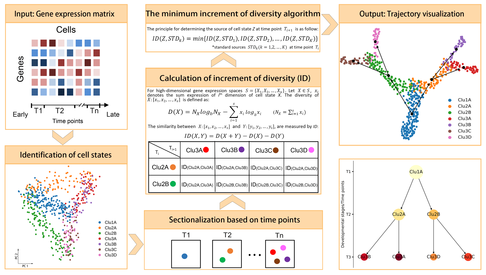

# IDTI: An increment of diversity method for cell trajectory inference of time-series scRNA-seq data
### Overview：

We present IDTI based on the increment of diversity for trajectory inference from time-series scRNA-Seq data, which combines time series information and increment of diversity method to infer cell state trajectory.

### Systems Requirements

The scripts were written in Python language.

To run the scripts, you need several python packages, as follows:

- numpy 

- pandas 

- scanpy

- anndata 

- networkx

- matplotlib

- sklearn

- pygraphviz

  ​

Recommended install command:

conda create -n idti -c conda-forge -c bioconda  python=3.7 scanpy matplotlib scikit-learn pygraphviz

### Usage

There are two main folders:

The folder "test_data" contains test data, which is the simulated time-series scRNA-seq data.
1. Subfile "sim_counts.csv" is the gene expression matrix of simulated data.
2. Subfile "sim_metadata" is the metadata of simulated data.
3. Subfile "sim_data.h5ad" is the H5AD file of simulated data.

The folder "script" contains main script.
"core.py" is used for IDTI cell state trajectory inference.

